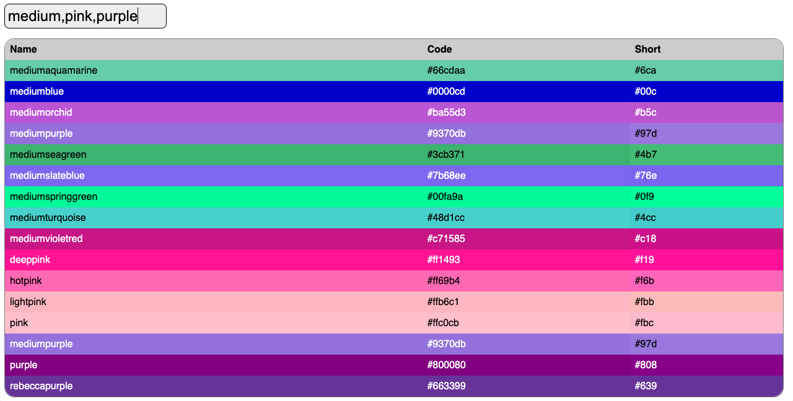
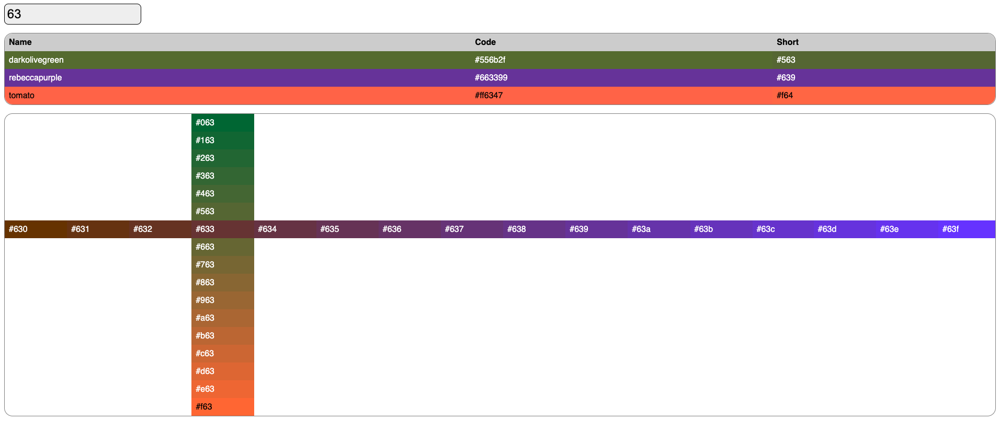

# Color Explorer

This is an app for exploring colors, built for fun. It's an exercise to learn
web development fundamentals, using the simplest technology stack: plain HTML,
CSS, & JS.

## Exercise Constraints
- No libraries, frameworks, templates, or preprocessors outside Node.js
- Limited dev tools:
  - [ESLint](https://www.npmjs.com/package/eslint)
  - [nodemon](https://www.npmjs.com/package/nodemon)

## Goals
- [x] Show all of the [CSS color names](https://en.wikipedia.org/wiki/Web_colors).
- [x] Show all 4096 shorthand color codes (e.g. "#639").
- [x] Show white or black text depending on the color's [brightness (a.k.a. luma)](https://en.wikipedia.org/wiki/Luma_%28video%29).
- [x] Filter color names & codes, given a substring (e.g. "blue" or "0f").




## Development
Install the dependencies by running:
```sh
npm install
```
Start the node server with:
```sh
npm run dev
```

favicon by [Twemoji](https://twemoji.twitter.com/), licensed as [CC-BY
4.0](https://creativecommons.org/licenses/by/4.0/).
